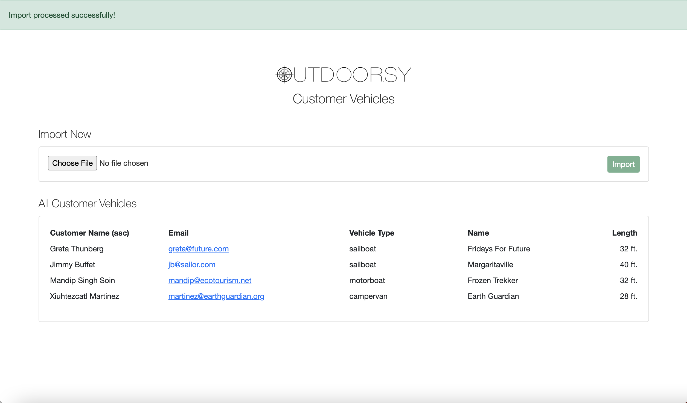

# README

# Outdoor.sy



## Introduction

Outdoor.sy is a tiny RoR app for a fictional company called Outdoor.sy that takes some of their customer lists and returns the data in different sorted orders.

The basics:
- [Ruby 3.1.1](https://www.ruby-lang.org/en/news/2022/02/18/ruby-3-1-1-released/)
- [Rails 7.0.2.3](https://rubyonrails.org/2022/3/8/Rails-7-0-2-3-6-1-4-7-6-0-4-7-and-5-2-6-3-have-been-released)
- [Postgres](https://www.postgresql.org/)
- [Bootstrap 5](https://getbootstrap.com/docs/5.0/getting-started/introduction/)
- [StimulusJS](https://github.com/hotwired/stimulus) ([reference](https://stimulus.hotwired.dev/))
- [Turbo](https://github.com/hotwired/turbo-rails) ([reference](https://turbo.hotwired.dev/))
- [RSpec](https://rspec.info/) with [Shoulda Matchers](https://github.com/thoughtbot/shoulda-matchers)

*Javascript must be enabled to use the app, as it leverages js for input validation and sorting.*


## How does it work?

Outdoor.sy is backed by a `Vehicle` model and corresponding `vehicles` table. The app takes a file upload of customer vehicle data, persists it to the database (see below for more on validations) and then displays all vehicle records from the database in a table that can be sorted by the customer's full name or the vehicle type.

**File Specifications**

The file must be of type `'text/plain'` or `'text/csv'`, delimited with either comma (`','`) or pipe (`'|'`), and contain the following information per row:

- customer first name
- customer last name
- customer email address
- vehicle type
- vehicle name
- vehicle length in feet

Supported vehicle types are: bicycle, campervan, motorboat, rv, sailboat

Vehicle length should be a whole number integer in feet (unit can be provided but is ignored)

Valid sample import file contents:

```
Greta,Thunberg,greta@future.com,sailboat,Fridays For Future,32’
Xiuhtezcatl,Martinez,martinez@earthguardian.org,campervan,Earth Guardian,28 feet
Mandip,Singh Soin,mandip@ecotourism.net,motorboat,Frozen Trekker,32’
Jimmy,Buffet,jb@sailor.com,sailboat,Margaritaville,40 ft
```

**Vehicle Validations**

`Vehicle` attributes:

- `customer_full_name`
- `customer_email`
- `vehicle_type`
- `vehicle_name`
- `vehicle_length`

Presence:

All attributes are required

Inclusion:

`vehicle_type` is a enum with values bicycle, campervan, motorboat, rv, or sailboat. The value of `vehicle_type` is not separately validated at the model level for inclusion in `Vehicle#vehicle_types` because we get that check for free at the db level by virtue of being an enum column.

Numericality:

`vehicle_length` is expected to be an integer greater than 0. Since the value the service attempts to store comes from extracting digits from the string provided if there were no digits within the string, or no value provided for length, then both `''.to_i` and `nil.to_i` evaluate to zero and are handled by the `greater_than: 0` validation.

Uniqueness

At both the database and model level, vehicles are prohibited from having the same combination of customer email, vehicle name and vehicle type. (This was a best-guess based on what seemed logical in the real world, recognizing that boats can have the same name but it's not *likely* that one person owns two boats of the same name and type.)

## Importer Service

The importer service — for the purposes of the exercise - expects a well-formed file without blanks, of type `'text/plain'` or `'text/csv'`, containing valid `vehicle_type` values, and `vehicle_length` strings that include an integer.

The service sidesteps creating duplicate `Vehicle` records by virtue of using `find_or_initialize_by`, so the same file can be imported multiple times safely and exact duplicates within an individual file are not problematic.

The service will stop when it encounters a row in the file does not translate to a valid `Vehicle` record. Rows processed ahead of the invalid row are persisted - the problematic row(s) can be address and the whole file retried without risk of creating duplicates.

## Didn't Do
I have not gone deep in many areas given that this is an exercise. Were this a real world scenario, the following should be accounted for:

- **file type**: the file picker has been restricted to 'text/plain' and 'text/csv' but this can be bypassed and the service should ensure it has an expected file type (as-is, a `CSV::MalformedCSVError` error will be raised if the file received is not delimited data)
- **file delimiter**: the data delimiter should be detected to ensure it is one of the supported options, and should raise a user-friendly error if not (as-is, if delimiter is not comma or pipe then the `DelimiterHelper` will return nil which will translate to an `ArgumentError` on when `CSV` is given a `nil` value for the `col_sep` argument.)
- **validation errors**: a more robust version of service could evaluate the rows independently, persist those that are valid, and provide back errors for any that were invalid. The limited version here surfaces only the error for the first invalid `Vehicle` it encounters.
- **processing**: the processing of the file should be delegated to a background job so that it can handle larger files/longer processing time without impacting overall performance. I'd likely also model a concept of an import so that I could store a status and timestamp for when it had been successfully processed.


## Additional Known Limitations

- The `customer_full_name` value is derived from the provided first and last name values. One of the two values (first or last name) can be blank and the record will be persisted successfully with whichever value was present. I opted not to bloat `Vehicle` with separate first and last name fields here, and in the real world would model a concept of a `User` so this data did not live on the `Vehicle` model
- Email value is not validated
- If the hidden field values for column or direction are manipulated and as such contain unexpected values no filtering of the data will take place


## Setup

After cloning the repo and ensuring you have the appropriate Ruby and Rails versions:

- `bundle install`
- `bundle exec rake db:setup`
- `yarn`
- `bin/dev`

- visit http://localhost:3000/

**Tests**

I've added a brief model spec and service spec.

Run both with:

```
bundle exec rspec spec
```

**Sample Files**

Tests leverage files under `spec/fixtures/files` that you may also use to experiment with the app. 
